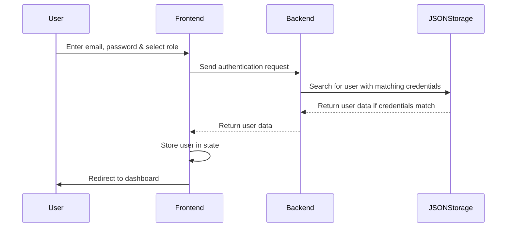
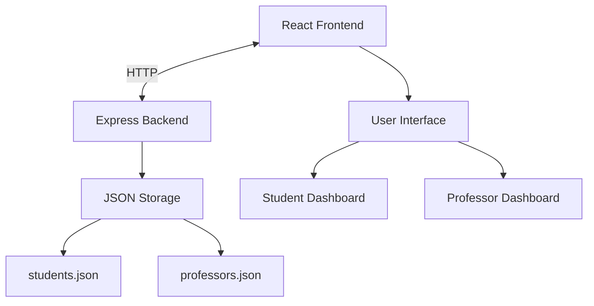
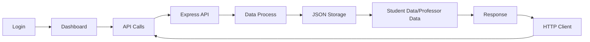
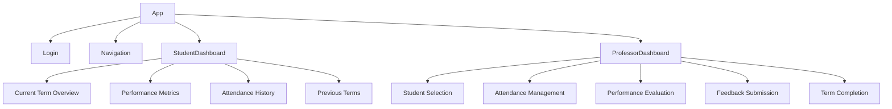
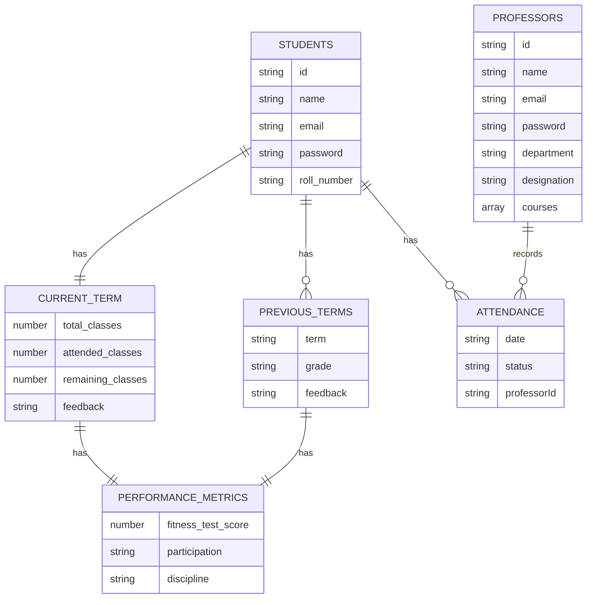

# PEP-App-Demo-
# University Personality Enhancement Program (PEP) Application Documentation

## Table of Contents

1. [Usage Instructions](#usage-instructions)
2. [Introduction](#introduction)
3. [System Architecture](#system-architecture)
4. [Data Structure](#data-structure)
5. [API Documentation](#api-documentation)
6. [Frontend Components](#frontend-components)
7. [Authentication Flow](#authentication-flow)
8. [High-Level Diagram](#high-level-diagram)

## Usage Instructions

### Getting Started

The University Personality Enhancement Program (PEP) Application provides separate interfaces for students and professors to manage physical education activities. Follow these instructions to use the application effectively.

### Login

1. Access the application through your web browser
2. On the login page, enter your university email and password
3. Select your role (Student or Professor) from the dropdown menu
4. Click the "Login" button

**Demo Credentials:**
- Student: srihari@vijaybhoomi.edu.in / 12345678
- Professor: rinu.babu@vijaybhoomi.edu.in / 12345678

### For Students

After logging in as a student, you will be directed to the Student Dashboard where you can:

1. **View Current Term Overview**
   - See total classes, attended classes, and remaining classes
   - Check your attendance rate visualized as a progress bar

2. **Check Performance Metrics**
   - View your fitness test scores
   - See participation and discipline ratings

3. **Read Professor Feedback**
   - Access feedback provided by your professor

4. **Review Attendance Records**
   - See a chronological list of your attendance status for each class

5. **Access Previous Terms**
   - View historical performance data and grades from past terms

### For Professors

After logging in as a professor, you will be directed to the Professor Dashboard where you can:

1. **Select a Student**
   - Choose a student from the dropdown menu to view or update their information

2. **Record Attendance**
   - Select a date
   - Mark a student as present or absent
   - Submit the attendance record

3. **Update Performance Metrics**
   - Enter fitness test scores
   - Rate student participation and discipline
   - Save the performance metrics

4. **Provide Feedback**
   - Enter constructive feedback for the student
   - Submit the feedback

5. **Complete Academic Terms**
   - Finalize a term with a grade
   - Move current term data to previous terms history

## Introduction

The University Personality Enhancement Program (PEP) Application is a web-based system designed to manage physical education courses at a university. It provides functionality for professors to track student attendance, record performance metrics, provide feedback, and complete academic terms. Students can view their attendance records, performance metrics, and feedback from professors.

## System Architecture

The application follows a client-server architecture with a clear separation between the frontend and backend:

### Backend

- **Technology**: Node.js with Express.js framework
- **Data Storage**: JSON files (students.json and professors.json)
- **API**: RESTful API endpoints for data operations

### Frontend

- **Technology**: React.js with Bootstrap for UI components
- **State Management**: React hooks (useState, useEffect)
- **Routing**: React Router for navigation
- **HTTP Client**: Axios for API communication

## Data Structure

### Students

Students are stored in `students.json` with the following structure:

```json
{
  "id": "1",
  "name": "Srihari S K",
  "email": "srihari@vijaybhoomi.edu.in",
  "password": "12345678",
  "roll_number": "2022OCTVUGP0000",
  "current_term": {
    "total_classes": 5,
    "attended_classes": 2,
    "remaining_classes": 3,
    "performance_metrics": {
      "fitness_test_score": 85,
      "participation": "Average",
      "discipline": "Good"
    },
    "feedback": "Srihari is performing well but needs to improve attendance."
  },
  "previous_terms": [
    {
      "term": "Independence 2024",
      "grade": "A",
      "performance_metrics": {
        "fitness_test_score": 90,
        "participation": "Excellent",
        "discipline": "Good"
      },
      "feedback": "Excellent performance throughout the term."
    }
  ],
  "attendance": [
    {
      "date": "2024-01-10",
      "status": "present",
      "professorId": "1"
    }
  ]
}
```

### Professors

Professors are stored in `professors.json` with the following structure:

```json
{
  "id": "1",
  "name": "Rinu Babu",
  "email": "rinu.babu@vijaybhoomi.edu.in",
  "password": "12345678",
  "department": "Physical Education",
  "designation": "Associate Professor",
  "courses": ["PEP101", "PEP201"]
}
```

## API Documentation

### Student Endpoints

#### GET /api/students
- **Description**: Retrieves all students
- **Response**: Array of student objects
- **Status Codes**: 200 (Success)

#### GET /api/students/:id
- **Description**: Retrieves a specific student by ID
- **Parameters**: id (student ID)
- **Response**: Student object
- **Status Codes**: 200 (Success), 404 (Not Found)

#### POST /api/students
- **Description**: Creates a new student
- **Request Body**: Student data (without ID)
- **Response**: Created student object with ID
- **Status Codes**: 201 (Created), 500 (Server Error)

#### PUT /api/students/:id
- **Description**: Updates a student's data
- **Parameters**: id (student ID)
- **Request Body**: Updated student data
- **Response**: Updated student object
- **Status Codes**: 200 (Success), 404 (Not Found), 500 (Server Error)

### Professor Endpoints

#### GET /api/professors
- **Description**: Retrieves all professors
- **Response**: Array of professor objects
- **Status Codes**: 200 (Success)

#### GET /api/professors/:id
- **Description**: Retrieves a specific professor by ID
- **Parameters**: id (professor ID)
- **Response**: Professor object
- **Status Codes**: 200 (Success), 404 (Not Found)

#### POST /api/professors
- **Description**: Creates a new professor
- **Request Body**: Professor data (without ID)
- **Response**: Created professor object with ID
- **Status Codes**: 201 (Created), 500 (Server Error)

### Attendance Endpoints

#### POST /api/attendance/:studentId
- **Description**: Records or updates attendance for a student
- **Parameters**: studentId (student ID)
- **Request Body**: 
  ```json
  {
    "date": "YYYY-MM-DD",
    "status": "present|absent",
    "professorId": "professor_id"
  }
  ```
- **Response**: Updated student object
- **Status Codes**: 200 (Success), 400 (Bad Request), 404 (Not Found), 500 (Server Error)

### Performance Endpoints

#### POST /api/performance/:studentId
- **Description**: Updates performance metrics for a student
- **Parameters**: studentId (student ID)
- **Request Body**: 
  ```json
  {
    "metrics": {
      "fitness_test_score": 85,
      "participation": "Average",
      "discipline": "Good"
    },
    "professorId": "professor_id"
  }
  ```
- **Response**: Updated student object
- **Status Codes**: 200 (Success), 400 (Bad Request), 404 (Not Found), 500 (Server Error)

### Feedback Endpoints

#### POST /api/feedback/:studentId
- **Description**: Adds feedback for a student
- **Parameters**: studentId (student ID)
- **Request Body**: 
  ```json
  {
    "feedback": "Feedback text",
    "professorId": "professor_id"
  }
  ```
- **Response**: Updated student object
- **Status Codes**: 200 (Success), 400 (Bad Request), 404 (Not Found), 500 (Server Error)

### Term Completion Endpoints

#### POST /api/complete-term/:studentId
- **Description**: Completes a term for a student, moves current term data to previous terms
- **Parameters**: studentId (student ID)
- **Request Body**: 
  ```json
  {
    "termName": "Fall 2023",
    "grade": "A"
  }
  ```
- **Response**: Updated student object
- **Status Codes**: 200 (Success), 400 (Bad Request), 404 (Not Found), 500 (Server Error)

## Frontend Components

### Login Component

- **File**: `frontend/src/components/Login.js`
- **Description**: Handles user authentication for both students and professors
- **Features**:
  - Email input
  - Role selection (student/professor)
  - Authentication against backend API

### Navigation Component

- **File**: `frontend/src/components/Navigation.js`
- **Description**: Provides navigation menu based on user role
- **Features**:
  - Conditional navigation links based on user role
  - Logout functionality

### Student Dashboard Component

- **File**: `frontend/src/components/student/StudentDashboard.js`
- **Description**: Dashboard for students to view their data
- **Features**:
  - Current term overview (total classes, attended classes, remaining classes)
  - Attendance rate visualization
  - Performance metrics display
  - Previous terms history
  - Attendance records

### Professor Dashboard Component

- **File**: `frontend/src/components/professor/ProfessorDashboard.js`
- **Description**: Dashboard for professors to manage student data
- **Features**:
  - Student selection
  - Attendance recording
  - Performance metrics input
  - Feedback submission
  - Term completion
  - Student data visualization

## Authentication Flow



## High-Level Diagram



### Data Flow Diagram



### Component Hierarchy



### Database Schema



This documentation provides a comprehensive overview of the University Personality Enhancement Program (PEP) Application, including its architecture, data structures, API endpoints, and component relationships. The high-level diagrams illustrate the system's structure and data flow, making it easier to understand how the different parts of the application interact with each other.
